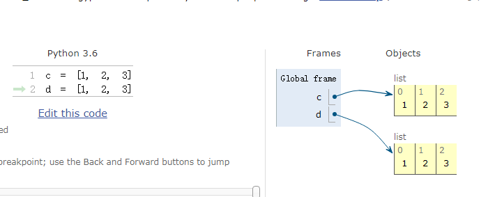

# Python 笔记

#### PEP8规范

PEP是Python Enhancement Proposal的缩写，通常翻译为“Python增强提案”。每个PEP都是一份为Python社区提供的指导Python往更好的方向发展的技术文档，其中的第8号增强提案（PEP 8）是针对Python语言编订的代码风格指南。尽管我们可以在保证语法没有问题的前提下随意书写Python代码，但是在实际开发中，采用一致的风格书写出可读性强的代码是每个专业的程序员应该做到的事情，也是每个公司的编程规范中会提出的要求，这些在多人协作开发一个项目（团队开发）的时候显得尤为重要。我们可以从Python官方网站的[PEP 8链接](https://www.python.org/dev/peps/pep-0008/)中找到该文档，下面我们对该文档的关键部分做一个简单的总结。

**空格的使用**

1. 使用空格来表示缩进而不要用制表符（Tab）。这一点对习惯了其他编程语言的人来说会觉得不可理喻，因为绝大多数程序员都用Tab来表示缩进，但是要知道Python并没有像C/C++或Java那样的用花括号来构造一个代码块的语法，在Python中分支和循环结构都使用缩进来表示哪些代码属于哪一个层级，鉴于此Python代码对缩进以及缩进宽度的依赖比其他很多语言都强得多。在不同的编辑器中，Tab的宽度可能是2个、4个或8个字符，甚至是其他更离谱的值，用Tab来表示缩进对Python代码来说并不可取。
2. 和语法相关的每一层缩进都用4个空格来表示。
3. 每行的字符数不要超过79个字符，如果表达式因太长而占据了多行，除了首行之外的其余各行都应该在正常的缩进宽度上再加上4个空格。
4. 函数和类的定义，代码前后都要用两个空行进行分隔。
5. 在同一个类中，各个方法之间应该用一个空行进行分隔。
6. 二元运算符的左右两侧应该保留一个空格，而且只要一个空格就好。

**标识符命名**

PEP 8倡导用不同的命名风格来命名Python中不同的标识符，以便在阅读代码时能够通过标识符的名称来确定该标识符在Python中扮演了怎样的角色（在这一点上，Python自己的内置模块以及某些第三方模块都做得并不是很好）。

1. 变量、函数和属性应该使用小写字母来拼写，如果有多个单词就使用下划线进行连接。
2. 类中受保护的实例属性，应该以一个下划线开头。
3. 类中私有的实例属性，应该以两个下划线开头。
4. 类和异常的命名，应该每个单词首字母大写。
5. 模块级别的常量，应该采用全大写字母，如果有多个单词就用下划线进行连接。
6. 类的实例方法，应该把第一个参数命名为`self`以表示对象自身。
7. 类的类方法，应该把第一个参数命名为`cls`以表示该类自身。

**表达式和语句**

在Python之禅（可以使用`import this`查看）中有这么一句名言：“There should be one-- and preferably only one --obvious way to do it.”，翻译成中文是“做一件事应该有而且最好只有一种确切的做法”，这句话传达的思想在PEP 8中也是无处不在的。

1. 采用内联形式的否定词，而不要把否定词放在整个表达式的前面。例如`if a is not b`就比`if not a is b`更容易让人理解。
2. 不要用检查长度的方式来判断字符串、列表等是否为`None`或者没有元素，应该用`if not x`这样的写法来检查它。
3. 就算`if`分支、`for`循环、`except`异常捕获等中只有一行代码，也不要将代码和`if`、`for`、`except`等写在一起，分开写才会让代码更清晰。
4. `import`语句总是放在文件开头的地方。
5. 引入模块的时候，`from math import sqrt`比`import math`更好。
6. 如果有多个`import`语句，应该将其分为三部分，从上到下分别是Python标准模块、第三方模块和自定义模块，每个部分内部应该按照模块名称的字母表顺序来排列。

**heapq(https://docs.python.org/2/library/heapq.html#module-heapq) — Heap queue algorithm**

该模块提供了堆队列算法的实现，也称为优先级队列算法 

```
"""
从列表中找出最大的或最小的N个元素
"""
import heapq

list1 = [34, 25, 12, 99, 87, 63, 58, 78, 88, 92]
list2 = [
    {'name': 'IBM', 'shares': 100, 'price': 91.1},
    {'name': 'AAPL', 'shares': 50, 'price': 543.22},
    {'name': 'FB', 'shares': 200, 'price': 21.09},
    {'name': 'HPQ', 'shares': 35, 'price': 31.75},
    {'name': 'YHOO', 'shares': 45, 'price': 16.35},
    {'name': 'ACME', 'shares': 75, 'price': 115.65}
]
print(heapq.nlargest(3, list1))
print(heapq.nsmallest(3, list1))
print(heapq.nlargest(3, list2, key=lambda x: x['shares']))
print(heapq.nsmallest(3, list2, key=lambda x: x['price']))
```

----

**Counter统计次数最多的元素**

```
"""
找出序列中出现次数最多的元素
"""

from collections import Counter

l = [1, 22, 33, 22, 12, 1, 1, 33]
c = Counter(l)
print(c.most_common(3))

#
[(1, 3), (22, 2), (33, 2)]
```

----

**字典的运算**

```
# zip() 函数用于将可迭代的对象作为参数，将对象中对应的元素打包成一个个元组，然后返回由这些元组组成的列表
# z = zip([1,2,3],['a','b'])
# print(list(z)) -->[(1, 'a'), (2, 'b')]

prices = {
'ACME': 45.23,
'AAPL': 612.78,
'IBM': 205.55,
'HPQ': 37.20,
'FB': 10.75
}

m = max(zip(prices.values(), prices.keys()))
print(m)
m1 = sorted(zip(prices.values(), prices.keys()))
print(m1)

# 查找字典中相同的地方
a = {
'x' : 1,
'y' : 2,
'z' : 3
}

b = {
'w' : 10,
'x' : 11,
'y' : 2
}

print(a.keys() & b.keys())
print(a.items() & b.items())

# 输出
(612.78, 'AAPL')
[(10.75, 'FB'), (37.2, 'HPQ'), (45.23, 'ACME'), (205.55, 'IBM'), (612.78, 'AAPL')]
{'x', 'y'}
{('y', 2)}
```

----

**OS**

```
import os

s = (os.path.abspath('w.py'))
# print(os.path.dirname('w.py'))
print(os.path.join('s:',s, 'r'))
# 第一个绝对路径之前的参数将被忽略
os.mkdir('jun')
if os.path.exists('jun'):
	os.rmdir('jun')

print(os.getcwd())
# 1
print(os.listdir('my_note'))
print(os.path.getsize('w.py')) # 字节
```

```
C:\Users\Administrator\Desktop\w.py\r
C:\Users\Administrator\Desktop
['.git', 'pythonWork']
313
```


**可变/不可变对象**

`不可变对象`，该对象所指向的内存中的值不能被改变，对象的值改变后对象的地址也改变

`可变对象`，该对象所指向的内存中的值可以被改变，但对象的地址始终不变

Python中，数值类型、字符串、元组都是不可变类型。而列表list、字典dict、集合set是可变类型。

以列表(可变对象)为例

```
l = [1,2]
print(id(l)) # 30237256
l[0] = 11
print(id(l)) # 30237256

# 对象的值改变了，对象的地址并未改变
```


以元祖(不可变对象)为例

```
t = ('a', 'b', ['c','d'])

print(id(t[2]),t) # 1925640 ('a', 'b', ['c', 'd'])
t[2][0] = 'e'
print(id(t[2]),t) # 1925640 ('a', 'b', ['e', 'd'])

# 这里的不变指的是指向不变，并不是内容不变
```

----

`global`和`nonlocal`关键字的作用

`global`：声明或定义全局变量

`nonlocal`：表示将变量声明为外层变量（外层函数的局部变量，而且不能是全局变量） 

python 在访问一个变量时，先要去定位这个变量来源于哪里。 
python引用变量的顺序如下：

1. 当前作用域局部变量
2. 外层作用域变量
3. 当前模块中的全局变量
4. python内置变量

```
a = 1
def fun():
    print(a) # 先引用
    a = 2 # 再修改
fun()
# 运行报错：UnboundLocalError: local variable 'a' referenced before assignment
# 根据变量查找顺序，内层没找到a用外层的1，但a已经指定为局部变量，无法用到外部的a，报错，可申明a为全局变量
global a

```

```
def outer_fun():
    a = 1
    def fun():
        global  a # a为外层变量
        print(a) # 输出1
        a = 2
    fun()
outer_fun()

# 报错：NameError: name 'a' is not defined

# 改进
def outer_fun():
    a = 1
    def fun():
        global  a # a为外层变量
        a = 1
        print(a) # 输出1
        a = 2
    fun()
    print(a) #输出1
outer_fun()

# 在使用 nonlocal a 之前，必须保证外层的确已经定义过 a 了，但是在 global a 的时候，可以允许全局变量中还没有定义过a，可以留在后面定义。比如将 print(a) 之前加上对a的定义，便不会出错
```

```
# nonlocal的用法
def outer_fun():
    a = 1
    def fun():
        nonlocal  a # a为外层变量
        print(a) # 输出1
        a = 2
    fun()
    print(a) #输出2
outer_fun()
```


---


**isinstance和type**

type()不会认为子类是一种父类类型

isinstance()会认为子类是一种父类类型

```
class A():
	pass
class W(A):
	pass
w = W()
print(type(w) == A)
print(isinstance(w, A))

# False
# True

```


----

**is 和 ==**

==是[python标准操作符](https://www.iplaypy.com/jichu/symbol.html)中的比较操作符，用来比较判断两个对象的value(值)是否相等 

is也被叫做同一性运算符，这个运算符比较判断的是对象间的唯一身份标识，也就是id是否相同 

```
a = '123'
b = '123'
c = [1, 2, 3]
d = [1, 2, 3]
print(a is b)
print(a == b)
print(d is c)
print(c == d)

-------------------------
True
True
False
True
```

备注：c和d的值一样，地址不一样，可用http://www.pythontutor.com可视化执行




----

#### Python高阶函数

**filter**

**filter()** 函数用于过滤序列，过滤掉不符合条件的元素，返回由符合条件元素组成的新列表 

```
def is_odd(n):
    return n % 2 == 1
 
newlist = filter(is_odd, [1, 2, 3, 4, 5, 6, 7, 8, 9, 10])
print(newlist)
```

**map()** 会根据提供的函数对指定序列做映射。

第一个参数 function 以参数序列中的每一个元素调用 function 函数，返回包含每次 function 函数返回值的新列表

```
m1 = list(map(lambda x: x ** 2, [1, 2, 3, 4, 5]) )
m = list(map(lambda x, y: x + y, [1, 3, 5, 7, 9], [2, 4, 6, 8, 10]))
print(m, m1)

[3, 7, 11, 15, 19] [1, 4, 9, 16, 25]
```

**reduce**

**reduce()** 函数会对参数序列中元素进行累积。

函数将一个数据集合（链表，元组等）中的所有数据进行下列操作：用传给 reduce 中的函数 function（有两个参数）先对集合中的第 1、2 个元素进行操作，得到的结果再与第三个数据用 function 函数运算，最后得到一个结果

```
from functools import reduce
s = reduce(lambda x, y: x+y , [1,2,4,5,3])
print(s)

#15
```


#### 时间模块

```
a = datetime.now()
print(a, type(a))
b = a.strftime('%Y-%m-%d')
print(b, type(b))
c = datetime.strptime(b, '%Y-%m-%d')
print(c, type(c))
delta = ds.timedelta(days=3) 
print(delta, type(delta))
d = delta + c
print(d, type(d))

# 输出结果
2019-04-07 20:43:35.493005 <class 'datetime.datetime'>
2019-04-07 <class 'str'>
2019-04-07 00:00:00 <class 'datetime.datetime'>
3 days, 0:00:00 <class 'datetime.timedelta'>
2019-04-10 00:00:00 <class 'datetime.datetime'>

```

```
#  输入某年某月某日，判断这一天是这一年的第几天

import datetime
def dayofyear():
	year = input("请输入年份：")
	month = input("请输入月份：")
	day = input("请输入天：")
	date1 = datetime.date(year=int(year),month=int(month),day=int(day))
	date2 = datetime.date(year=int(year),month=1,day=1)
	return (date1 - date2 ).days + 1

print(dayofyear())

#运行结果
请输入年份：2018
请输入月份：1
请输入天：2
2
```

---

#### random

random.random()：生成一个 0-1 之间的随机浮点数；
random.uniform(a, b)：生成[a,b]之间的浮点数；
random.randint(a, b)：生成[a,b]之间的整数；
random.randrange(a, b, step)：在指定的集合[a,b)中，以 step 为基数随机取一个数

random.shuffle(alist) :打乱序列

```
import random

print(random.random())
print(random.uniform(1, 5))
print(random.randint(1,10))
print(random.randrange(1, 10, 2))
l = [1,2,3,4,5,6]
print(random.shuffle(l))
print(l)

# 运行结果
0.5951348446319553
3.359478757914984
10
3
None
[3, 4, 5, 1, 6, 2]

```

----

####python日志

**logging模块的日志级别**

logging模块默认定义了以下几个日志等级，它允许开发人员自定义其他日志级别，但是这是不被推荐的，尤其是在开发供别人使用的库时，因为这会导致日志级别的混乱。

| 日志等级（level） | 描述                                                         |
| ----------------- | ------------------------------------------------------------ |
| DEBUG             | 最详细的日志信息，典型应用场景是 问题诊断                    |
| INFO              | 信息详细程度仅次于DEBUG，通常只记录关键节点信息，用于确认一切都是按照我们预期的那样进行工作 |
| WARNING           | 当某些不期望的事情发生时记录的信息（如，磁盘可用空间较低），但是此时应用程序还是正常运行的 |
| ERROR             | 由于一个更严重的问题导致某些功能不能正常运行时记录的信息     |
| CRITICAL          | 当发生严重错误，导致应用程序不能继续运行时记录的信息         |

**说明：**

- 上面列表中的日志等级是从上到下依次升高的，即：DEBUG < INFO < WARNING < ERROR < CRITICAL，而日志的信息量是依次减少的；
- 当为某个应用程序指定一个日志级别后，应用程序会记录所有日志级别大于或等于指定日志级别的日志信息，而不是仅仅记录指定级别的日志信息，nginx、php等应用程序以及这里要提高的python的logging模块都是这样的。同样，logging模块也可以指定日志记录器的日志级别，只有级别大于或等于该指定日志级别的日志记录才会被输出，小于该等级的日志记录将会被丢弃。

**logging模块中定义好的可以用于format格式字符串中的字段：**

| 字段/属性名称   | 使用格式            | 描述                                                         |
| --------------- | ------------------- | ------------------------------------------------------------ |
| asctime         | %(asctime)s         | 日志事件发生的时间--人类可读时间，如：2003-07-08 16:49:45,896 |
| created         | %(created)f         | 日志事件发生的时间--时间戳，就是当时调用time.time()函数返回的值 |
| relativeCreated | %(relativeCreated)d | 日志事件发生的时间相对于logging模块加载时间的相对毫秒数（目前还不知道干嘛用的） |
| msecs           | %(msecs)d           | 日志事件发生事件的毫秒部分                                   |
| levelname       | %(levelname)s       | 该日志记录的文字形式的日志级别（'DEBUG', 'INFO', 'WARNING', 'ERROR', 'CRITICAL'） |
| levelno         | %(levelno)s         | 该日志记录的数字形式的日志级别（10, 20, 30, 40, 50）         |
| name            | %(name)s            | 所使用的日志器名称，默认是'root'，因为默认使用的是 rootLogger |
| message         | %(message)s         | 日志记录的文本内容，通过 `msg % args`计算得到的              |
| pathname        | %(pathname)s        | 调用日志记录函数的源码文件的全路径                           |
| filename        | %(filename)s        | pathname的文件名部分，包含文件后缀                           |
| module          | %(module)s          | filename的名称部分，不包含后缀                               |

```
import logging
LOG_FORMAT = "%(asctime)s - %(levelname)s - %(message)s"
logging.basicConfig(filename='my.log', level=logging.DEBUG, format=LOG_FORMAT)
logging.debug("This is a debug log.")
logging.info("This is a info log.")
logging.warning("This is a warning log.")
logging.error("This is a error log.")
logging.critical("This is a critical log.")

# 生成my.log文件
2019-04-07 21:37:16,031 - DEBUG - This is a debug log.
2019-04-07 21:37:16,070 - INFO - This is a info log.
2019-04-07 21:37:16,071 - WARNING - This is a warning log.
2019-04-07 21:37:16,071 - ERROR - This is a error log.
2019-04-07 21:37:16,071 - CRITICAL - This is a critical log.

```

#### 切片

**为什么切片和区间会忽略最后一个元素(参考《流畅的python》)**

```
	在切片和区间操作里不包含区间范围的最后一个元素是 Python 的风格，这个习惯符合 Python、C 和其他语言里以 0 作为起始下标的传统。这样做带来的好处如下。
1.当只有最后一个位置信息时，我们也可以快速看出切片和区间里有几个元素：range(3) 和 my_list[:3] 都返回 3 个元素。
2.当起止位置信息都可见时，我们可以快速计算出切片和区间的长度，用后一个数减去第一个下标（stop - start）即可。
3.这样做也让我们可以利用任意一个下标来把序列分割成不重叠的两部分，只要写成 my_list[:x] 和 my_list[x:] 就可以了
```

**给切片赋值**

```
l = list(range(10))
print(l)
l[1:3] = [20, 30]
print(l)
del l[3:5]
print(l)
# 输出结果
[0, 1, 2, 3, 4, 5, 6, 7, 8, 9]
[0, 20, 30, 3, 4, 5, 6, 7, 8, 9]
[0, 20, 30, 5, 6, 7, 8, 9]
# 如果赋值的对象是一个切片，那么赋值语句的右侧必须是个可迭代对象。即便只有单独一个值，也要把它转换成可迭代的序列
```

**对序列使用+和***

慎用*

```
y = [['*'] * 3] * 3
print(y)
y[0][1] = '#'
print(y)

y1 = [['x'] * 3 for _ in range(3)]
print(y)
y1[0][1] = 'y'
print(y1)

# 输出
[['*', '*', '*'], ['*', '*', '*'], ['*', '*', '*']]
[['*', '#', '*'], ['*', '#', '*'], ['*', '#', '*']]
[['*', '#', '*'], ['*', '#', '*'], ['*', '#', '*']]
[['x', 'y', 'x'], ['x', 'x', 'x'], ['x', 'x', 'x']]

#  第一个例子3个引用指向的都是同一个列表，改变其中一个另外几个都会发生改变，若不期望出现这种情况，应该用第二个例子的方法
```

#### 引用

```
def extendlist(val, list=[]):
	list.append(val)
	return list
list1 = extendlist(10)
list2 = extendlist(123, [])
list3 = extendlist('a')
print("list1 = %s" %list1, id(list1))
print("list2 = %s" %list2)
print("list3 = %s" %list3,id(list3))
# 输出结果
list1 = [10, 'a'] 5988872
list2 = [123]
list3 = [10, 'a'] 5988872
```


**浅拷贝与深拷贝**

`浅拷贝`：只拷贝父对象，不会拷贝对象的内部的子对象 

`深拷贝`：拷贝对象及其子对象 

```
# 深拷贝（str()方法也是完全拷贝）
import copy
c1 = [1,2,3,4,[12,33]]
c2 = copy.copy(c1)
c3 = copy.deepcopy(c2)
c1[4][0] = "jun" 
print(c2,c3)
>>>[1, 2, 3, 4, ['jun', 33]] [1, 2, 3, 4, [12, 33]]
# 浅拷贝(切片为浅拷贝)
l = [1,2,3,4,[11, 22, 33]]
l2 = l[:]
l2[4][0] = "wu"
print(l)
print(l2)
>>>[1, 2, 3, 4, ['wu', 22, 33]]
   [1, 2, 3, 4, ['wu', 22, 33]]
   
```

---------------


**列表相关操作**

```
#列表间支持'+'运算
s = [1, 2, 3] + [4, 5, 6, [11, 22]]
print(s) #[1, 2, 3, 4, 5, 6, [11, 22]]

# 列表extend方法，将一个序列中的每个元素添加到列表
s = []
s.extend('12345') #['1', '2', '3', '4', '5']

# 如果是字典则只填加字典的键
s.extend({'a':1,'b':2}) #['1', '2', '3', '4', '5', 'a', 'b']


```
----------

#### 面向对象

类：就是拥有相同功能和相同属性的对象的集合（类是抽象）
对象：类的实例（对象是具体的）

**多重继承**

python多重继承的MRO算法选择： 经典方式、Python2.2 新式算法、Python2.3 新式算法(C3)。Python 3中只保留了最后一种，即C3算法 

```
class A(object):
	def dog(self):
		print('dogA')

	def ping(self):
		print('pingE')
		

class B(A):
	def dog(self):
		print('dogb')


class C(A):
	def dog(self):
		print('dogc')


class E(B, C):
	def ping(self):
		print('doge')


e = E()
print(E.__mro__)
e.dog()
结果：
(<class '__main__.E'>, <class '__main__.B'>, <class '__main__.C'>, <class '__main__.A'>, <class 'object'>)
dogb

```


#### 生成器与迭代器

* 可迭代对象

  只要实现了\__iter__方法的对象就是可迭代的 

* 使用isinstance()判断对象是否为可迭代对象（字符串、列表、集合等都是可迭代的） 

* 可迭代对象均可以通过内置函数iter()来转变为迭代器

**迭代器**

迭代是访问集合元素的一种方式，迭代器对象从集合的第一个元素开始访问，直到所有的元素被访问完结束 

 只要定义了\__next ()__ 方法就是一个迭代器

```
""" 
class Fib():
	"""迭代器"""
    def __init__(self, num):
        self.a = 1
        self.b = 0
        self.index = 0
        self.num = num

    def __iter__(self):
        return self #返回自身

    def __next__(self):
        if self.index < self.num:
            self.a, self.b = self.a + self.b, self.a
            self.index += 1
            return self.b
        else:
            raise StopIteration()
```

**生成器**

生成器也是一中迭代器，它按照顺序返回一个或多个值直到完成函数的迭代而终止，大多数时候生成成器是以函数来实现的，使用yield返回值，每次调用yield会暂停直到调用代码恢复生成器。 

```
# 简单生成器
x = (i for i in range(1))
print(x) # <generator object <genexpr> at 0x0000000002D548B8>

# 生成器函数
def test():
	for i in range(10):
		yield i
```

**协程**

协程，又称微线程，纤程。英文名Coroutine，**是一种用户态的轻量级线程**。

​	协程拥有自己的寄存器上下文和栈。协程调度切换时，将寄存器上下文和栈保存到其他地方（线程调度时候寄存器上下文及栈等保存在内存中），在切回来的时候，恢复先前保存的寄存器上下文和栈。

关于协程在一片博客上有讲到https://www.cnblogs.com/zhangxinqi/p/8337207.html

```
协程，又称微线程，纤程。英文名Coroutine。
	线程是系统级别的它们由操作系统调度，而协程则是程序级别的由程序根据需要自己调度。在一个线程中会有很多函数，我们把这些函数称为子程序，在子程序执行过程中可以中断去执行别的子程序，而别的子程序也可以中断回来继续执行之前的子程序，这个过程就称为协程。也就是说在同一线程内一段代码在执行过程中会中断然后跳转执行别的代码，接着在之前中断的地方继续开始执行，类似与yield操作。
```

**产出两个值的协程**

```
def cor2(a):
		print('start! a=',a)
		b = yield a
		print('this is b :',b)
		c = yield a + b
		print('this is c:',c)
		
try:
	s = cor2(1)
	print(next(s))
	print(s.send(2))
	s.send(3)
except StopIteration:
	pass
# 执行结果
start! a= 1
1
this is b : 2
3
this is c: 3
# 调用next()函数进入生产器
# 把2发给协程，产出a+b
# 把3发给协程，输出c的值
# 执行结束产生StopIteration异常
# 注意：协程在 yield 关键字所在的位置暂停执行,在赋值语句中，= 右边的代码在赋值之前执行
```

**异步IO：**

Python 3.4版本引入`asyncio` 标准库，直接内置了对异步IO的支持 ,Python 3.5开始引入了新的语法`async`和`await` 

- Event Loop 事件循环：程序开启一个 While True 循环，用户将一些函数注册到事件循环上，当满足事件执行条件时，调用的协程函数；
- Task：对协程对象的进一步封装，包括任务的各种状态；
- Future：代表将来执行或没有执行的任务的结果，和 Task 没有本质的区别；
- await：挂起阻塞的异步调用接口；

```
import asyncio

async def show1():
    """输出0-4"""
    for i in range(5):
        print('show1',i)
        await asyncio.sleep(1) #等待2s
async def show2():
    """输出5-9"""
    for i in range(5,10):
        print('show2',i)
        await asyncio.sleep(1) #等待2s

def main():
    """主函数"""
    loop = asyncio.get_event_loop() #获得系统默认的事件循环
    future = asyncio.gather(show1(),show2()) #通过gather函数可以获得一个future对象
    loop.run_until_complete(future) #等待通过future对象获得协程执行结果。
    loop.close()


if __name__ == '__main__':
    main()

```

输出结果：

```
show1 0
show2 5
show1 1
show2 6
show1 2
show2 7
show1 3
show2 8
show1 4
show2 9
```

#### 类与对象

```
class C1:
    # 类字段
    number = 100

    def __init__(self, name):
    	self.name = name

    # 声明一个对象方法
    def object_func(self):
        print('对象方法')
        print(self.name)

    # 声明一个类方法
    @classmethod
    def class_func(cls):
        # 通过cls去使用类的字段
        print('cls:', cls.number)
        # 通过cls去创建对象
        tc = cls()
        tc.object_func()
        print('这是一个类方法')

    @staticmethod
    def static_func():
        print('这是一个静态方法')
        
 # 实例方法只能被实例对象调用，静态方法(由@staticmethod装饰的方法)、类方法(由@classmethod装饰的方法)，可以被类或类的实例对象调用。
 # 静态方法和类成员方法都可以被类或实例访问
 # 静态方法无需传入self参数，类成员方法需传入代表本类的cls参数
 # 静态方法是无法访问实例变量的，而类成员方法也同样无法访问实例变量，但可以访问类变量
```


#### 进程和线程

* 进程是资源（CPU、内存等）分配的基本单位 
* 线程是程序执行时的最小单位 

**全局解释器锁（GIL)**

对于GIL，在《Python 核心编程》有这样一段描述

```
Python 代码的执行是由 Python 虚拟机（又名解释器主循环）进行控制的。Python 在
设计时是这样考虑的，在主循环中同时只能有一个控制线程在执行，就像单核 CPU 系统
中的多进程一样。内存中可以有许多程序，但是在任意给定时刻只能有一个程序在运行。
同理，尽管 Python 解释器中可以运行多个线程，但是在任意给定时刻只有一个线程会被
解释器执行。
对 Python 虚拟机的访问是由全局解释器锁（GIL）控制的。这个锁就是用来保证同时只
能有一个线程运行的
```


**多线程**

 Python提供了threading 模块来支持多线程

创建线程有3种方式

* 通过Thread类来实现
* 通过之定义类，并继承Thread实现
* 使用线程池实现

```
"""模拟100个人同时还书"""

import threading
import time
from concurrent.futures import ThreadPoolExecutor

class Library():
    """图书馆借书系统"""

    def __init__(self):
        self.books = 0

    def re_book(self, book):
        """还书"""

        new_nums = self.books + book
        time.sleep(0.01)
        self.books = new_nums

class AddBookThread(threading.Thread):
    """自定义线程类"""

    def __init__(self, account, book):
        self.account = account
        self.book = book
        # 自定义线程的初始化方法中必须调用父类的初始化方法
        super().__init__()

    def run(self):
        # 线程启动之后要执行的操作
        self.account.re_book(self.book)


def main():
    # 创建线程池
    pool = ThreadPoolExecutor(10)
    futures = []
    library = Library()
    ts = []
    for _ in range(100):
        # 创建线程的第1种方式
        t = threading.Thread(target=library.re_book, args=(1, ) )
        ts.append(t)
        # 创建线程的第2种方式
        # AddBookThread(library, 1).start()

    for t in ts:
        t.start()
    # 等待子进程全部结束
    for t in ts:
        t.join()
        
   # 创建线程的第3种方式 
   #  for _ in range(100):
       # 调用线程池中的线程来执行特定的任务
       # 通过submit函数提交执行的函数到线程池中，submit函数立即返回，不阻塞
       # future = pool.submit(library.re_book, 1)
       # futures.append(future)
       #future的result()方法可以获取到函数的执行结果, 这个方法是阻塞的
       # for li in futures:
       #     print(li.result())

    # 关闭线程池
    pool.shutdown()
    print(library.books)

if __name__ == '__main__':
    main()
# 输出结果：6 这是因为多个进程在同一时刻可能取到相同的数据，GIL保护的是解释器级的数据，保护用户自己的数据则需要自己加锁处理
# 使用Lock()来保护资源，对Library类进行修改
class Library():
    """图书馆借书系统"""

    def __init__(self):
        self.books = 0
        self.lock = threading.Lock()

    def re_book(self, book):
        """还书"""
        with self.lock:
            new_nums = self.books + book
            time.sleep(0.001)
            self.books = new_nums
# 修改后再运行结果为100
```
对上面程序进行修改，实现5个人借书，5个人还书，图书馆书不够时就暂停等待有书为止

使用`threading`模块的Condition来实现线程调度 ，实现在某个事件触发后才处理数据 

- wait:线程挂起收到notify通知后继续运行  
-  notify:通知其他线程, 解除其它线程的wai状态  -
- notify_All(): 通知所有线程  
-  acquire和release: 获得[锁和](https://www.baidu.com/s?wd=%E9%94%81%E5%92%8C&tn=24004469_oem_dg&rsv_dl=gh_pl_sl_csd)解除锁, 与lock类似,


```
"""多个线程的调度 - 暂停线程执行/唤醒等待中的线程 - Condition"""

from random import randint
import time
import threading

class Library():
    """图书馆系统"""

    def __init__(self):
        self.books = 0
        lock = threading.Lock()
        self.condition = threading.Condition(lock)

    def re_book(self, book):
        """还书"""
        with self.condition:
            new_nums = self.books + book
            time.sleep(0.01)
            self.books = new_nums
            self.condition.notify_all() #
            
    def bo_book(self, book):
        """借书"""
        with self.condition:
            while book > self.books:
                self.condition.wait() # 等待
            new_nums = self.books - book
            time.sleep(0.01)
            self.books = new_nums

def add_book(account):
    while True:
        book = randint(5, 10)
        account.re_book(book)
        print(threading.current_thread().name, 
              ':', '-----还书-----',book)
        time.sleep(0.5)


def sub_book(account):
    while True:
        book = randint(10, 30)
        account.bo_book(book)
        print(threading.current_thread().name, 
              ':', '图书馆总数-------------', account.books, '借书',book)
        time.sleep(1)


def main():
    """创建线程"""

    account = Library()
    for _ in range(5):
        threading.Thread(target=add_book, args=(account,)).start()
        threading.Thread(target=sub_book, args=(account,)).start()


if __name__ == '__main__':
    main()
```

运行结果：

```
Thread-3 : -----还书----- 5
Thread-9 : -----还书----- 8
Thread-7 : -----还书----- 9
Thread-10 : 图书馆总数------------- 14 借书 13
Thread-1 : -----还书----- 7
Thread-8 : 图书馆总数------------- 0 借书 21
Thread-5 : -----还书----- 8
Thread-3 : -----还书----- 10
Thread-9 : -----还书----- 7
Thread-7 : -----还书----- 5
Thread-2 : 图书馆总数------------- 0 借书 30
Thread-1 : -----还书----- 
```

#### 元类

**metaclass**

除了使用`type()`动态创建类以外，要控制类的创建行为，还可以使用metaclass

```
class F(type):
	def __new__(cls, name, bases, attrs):
		attrs['add'] = 1
		return type.__new__(cls, name, bases, attrs)

class M(metaclass=F):
	pass

a = M()
print(a.add)
```

