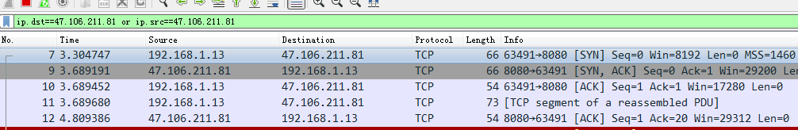

# 传输层

**在TCP/IP协议栈中，传输层为相互通讯的应用进程提供逻辑通讯**

**传输层有两个协议：TCP和UDP**

* TCP(Transmission Conctrol Protocol， 传输控制协议)
  * 可靠传输，面向连接，需要将传输文件分段，有流量控制功能
* UDP(User Data Protocol, 用户数据报协议)
  * 不可靠传输，不面向连接

$apr1​$T4V5lx4d$jiXmn4ikRQigjAF1zCdkE/

用Python来进行Socket编程 

笔者使用自己的电脑做客服端，阿里云做服务端，使用Wireshark来进行抓包分析TCP

```
"""客户端"""

	import socket
    # 1.创建套接字对象
    client = socket.socket()

    # 2.连接服务器
    client.connect(('47.106.211.81', 12345))

    # 接收消息
    data = client.recv(1024)
    print(data.decode(encoding='utf-8'))

    # 发送消息
    message = input('>>>')
    client.send(message.encode())
    
    client.close()
    
    """服务器端"""
    
    import socket

    # 1. 创建服务器套接字对象
    server = socket.socket()

    # 2. 绑定ip地址和端口
    server.bind(('', 8080))

    # 3. 监听
    server.listen(5)  # 5表示一次性能够接受的客服端请求数量

    # accept()会阻塞线程，当有客户端给这个服务器发送请求，才会开始执行
    client, addr = server.accept() #client是新的套接字对象，可以用来接收和发送数据, addr是连接客户端	的地址。
    print(client,addr)
    client.send('python'.encode())

    # 关闭
    
    client.close()
    server.close()
    
```




笔者使用ip.dst==47.106.211.81 or ip.src==47.106.211.81对数据进行过滤，这样就可以过滤源ip、目的ip 

**结合上面的数据来分析下TCP的3次握手**

**第一次握手：**建立连接时，客户端(上图的Source)向服务端（上图的Destination)发起连接请求报文段，这时首部中的同部位SYN为1（表示请求连接），Seq（用来标记数据段的顺序）为0，Len=0表示没有携带数据，MSS=1460表示最大数据包长度为1460字节。

**第二次握手：**服务端收到报文段后，同意请求并向客服端确认，此时SYN, ACK都为1，Win=29200表示向客服端说明服务端的最大接受缓存为29200字节

**第三次握手：**客户端收到服务器的确认，再次向服务端确认ACK=1表示确认

以上3次握手成功后表面建立连接成功

**为什么不是2次握手**

这主要是确保双方都做好了发送接受数据的准备工作，在《计算机网络》这本书中说A向B请求，最后A还要发一次确认主要是防止已失效的连接请求报文又传到B,从而造成错误。


