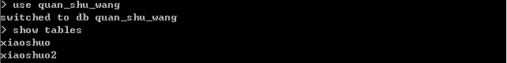
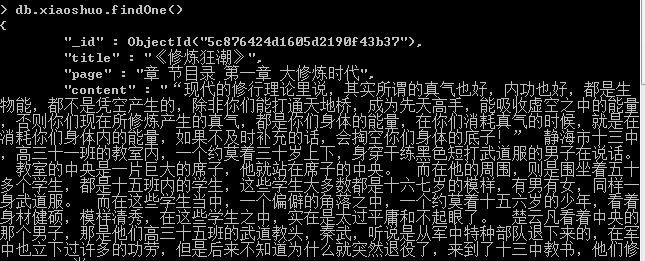
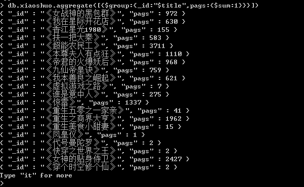

# MongoDB

MongoDB 是由C++语言编写的，是一个基于分布式文件存储的开源数据库系统。

在高负载的情况下，添加更多的节点，可以保证服务器性能。

MongoDB 旨在为WEB应用提供可扩展的高性能数据存储解决方案。

MongoDB 将数据存储为一个文档，数据结构由键值(key=>value)对组成。MongoDB 文档类似于 JSON 对象。字段值可以包含其他文档，数组及文档数组

 


mongodb文档的数据结构和JSON基本一样。

所有存储在集合中的数据都是BSON格式。

BSON 是一种类似 JSON 的二进制形式的存储格式，是 Binary JSON 的简称。


**MongoDB 删除文档**

执行两次插入操作：

```
>db.col.insert({title: 'mongodb'})
```

```
>db.col.insert({title: 'redis' })
```

使用 find() 函数查询数据 :

```
> db.col.find({title:'mongodb'})
{ "_id" : ObjectId("56066169ade2f21f36b03137"), "title" : "mongodb",
```

移除 title 为 'mongodb' 的文档： 

```
>db.col.remove({'title':'mongodb'})
WriteResult({ "nRemoved" : 1})           # 删除了1条数据
```


**MongoDB 更新文档**

```
> db.my.find()
{ "_id" : ObjectId("5cb3250b431662cfb08fe367"), "name" : "wu" }
> db.my.update({'name':'wu'},{$set:{'name':'wuminjun'}})
WriteResult({ "nMatched" : 1, "nUpserted" : 0, "nModified" : 1 })
> db.my.find()
{ "_id" : ObjectId("5cb3250b431662cfb08fe367"), "name" : "wuminjun" }
```

####Mongodb查询

**MongoDB 与 RDBMS Where 语句比较**

如果你熟悉常规的 SQL 数据，通过下表可以更好的理解 MongoDB 的条件语句查询：

| 操作       | 格式                     | 范例                                        | RDBMS中的类似语句       |
| ---------- | ------------------------ | ------------------------------------------- | ----------------------- |
| 等于       | `{<key>:<value>`}        | `db.col.find({"by":"菜鸟教程"}).pretty()`   | `where by = '菜鸟教程'` |
| 小于       | `{<key>:{$lt:<value>}}`  | `db.col.find({"likes":{$lt:50}}).pretty()`  | `where likes < 50`      |
| 小于或等于 | `{<key>:{$lte:<value>}}` | `db.col.find({"likes":{$lte:50}}).pretty()` | `where likes <= 50`     |
| 大于       | `{<key>:{$gt:<value>}}`  | `db.col.find({"likes":{$gt:50}}).pretty()`  | `where likes > 50`      |
| 大于或等于 | `{<key>:{$gte:<value>}}` | `db.col.find({"likes":{$gte:50}}).pretty()` | `where likes >= 50`     |
| 不等于     | `{<key>:{$ne:<value>}}`  | `db.col.find({"likes":{$ne:50}}).pretty()`  | `where likes != 50`     |

**OR**

```
> db.anjuke.find({ $or:[{'price':'4500'},{'price':'3500'}]})
{ "_id" : ObjectId("5c9146edc2172921569d4d44"), "title" : "6号线濠装上下两层 自带健身房游泳馆 随时看随时入住不能错过", "img_url" : "https://pic1.ajkimg.com/display/hj/0273f1a7938abc03940ad530199441f0/240x180m.jpg?t=1", "addr" : ",碧森里,海淀-田村 田村北路", "info" : "\n                            1室2厅", "price" : "4500" }
{ "_id" : ObjectId("5c9146eec2172921569d4d5a"), "title" : "专业代理一方国际楼盘 等各大高档楼盘 1.2.3.室均有", "img_url" : "https://pic1.ajkimg.com/display/hj/98631d1e3739e9bca19b9aaa3687a7bb/240x180m.jpg?t=1", "addr" : ",一方国际广场,中山-中山友好 安乐街29", "info" : "\n                            1室1厅", "price" : "3500" }
{ "_id" : ObjectId("5c9146eec2172921569d4d5b"), "title" : "中心裕景专业代理1室2室3室欧式风格多套房源", "i
```

**sort()**

```
> db.anjuke.find().skip(1000).sort({'price':1}).limit(3)
{ "_id" : ObjectId("5c91473ac2172921569d5459"), "title" : "火车站 红星巷银静花园2室2厅 家具家电齐全 拎包入住 租房", "img_url" : "https://pic1.ajkimg.com/display/hj/656dd1aaeaacb005042e9db5e31c15b4/240x180m.jpg?t=1", "addr" : ",银静花园,城关-火车站 火车站南路20-52号", "info" : "\n                            2室2厅", "price" : "1800" }
{ "_id" : ObjectId("5c91473dc2172921569d5473"), "title" : "四季青！婺江地铁站！汽车南站附近望江新园主卧带阳台出租！", "img_url" : "https://pic1.ajkimg.com/display/hj/2e25865e0e7e82e062391b528c24561b/240x180m.jpg?t=1", "addr" : ",望江新园一园,上城-城站 映霞街81号", "info" : "\n                            3室1厅", "price" : "1800" }
{ "_id" : ObjectId("5c91473ec2172921569d5482"), "title" : "出租 安宁 荣安居 两室 带简单家具 1800  干净整洁", "img_url" : "https://pic1.ajkimg.com/display/hj/1db8ce82a6827861679f14b3085336e8/240x180m.jpg?t=1", "addr" : ",荣安居小区,安宁-莫高大道 建安西路789", "info" : "\n                            2室2厅", "price" : "1800" }
```


**MongoDB Limit与Skip方法**

使用limit查看前5条数据

```
> db.anjuke.find(5)
2019-04-14T21:03:37.462+0800 don't know how to massage : number at src/mongo/shell/collection.js:130
> db.anjuke.find().limit(5)
{ "_id" : ObjectId("5c9146e6c2172921569d4d1b"), "title" : "康欣花园。东向单室。品质装修。拎包即住。", "img_url" : "https://pic1.ajkimg.com/display/hj/9fc59ee417499af4639c22e18eb95856/240x180m.jpg?t=1", "addr" : ",康欣花园,铁东-湖南 铁东二道街,近站前街", "info" : "\n                            1室1厅", "price" : "1500" }
{ "_id" : ObjectId("5c9146e8c2172921569d4d1c"), "title" : "时代说府37住36。70平精装冰箱电视洗衣机热水器床柜2千", "img_url" : "https://pic1.ajkimg.com/display/hj/62002d68a32d04e7d9a92d11cbfd2fdf/240x180m.jpg?t=1", "addr" : ",时代悦府,立山-立山广场 北胜利路189号", "info" : "\n                            2室1厅", "price" : "2000" }
{ "_id" : ObjectId("5c9146e8c2172921569d4d1d"), "title" : "绿色 智慧城单6住5，51平南北精装婚房全套家具家电1千", "img_url" : "https://pic1.ajkimg.com/display/hj/3c11c8413dd66fdb43ffbca2d2f1c949/240x180m.jpg?t=1", "addr" : ",绿色智慧城,立山-立山广场 莘英路", "info" : "\n                            1室1厅", "price" : "1000" }
{ "_id" : ObjectId("5c9146e8c2172921569d4d1e"), "title" : "立山公园孟家沟早市 63中学 拎包即住 一室一厅 大润发超市", "img_url" : "https://pic1.ajkimg.com/display/hj/695ac30d412520e9fad71c5c518cf33d/240x180m.jpg?t=1", "addr" : ",孟家沟街77号小区,立山-立山广场 孟家沟街77号", "info" : "\n                            1室1厅", "price" : "500" }
{ "_id" : ObjectId("5c9146e8c2172921569d4d1f"), "title" : "谦益堂超市附近 小区环境好 安全 一年7000 喜欢速来", "img_url" : "https://pic1.ajkimg.com/display/hj/82492e858d0b273d72e50d179351168e/240x180m.jpg?t=1", "addr" : ",金墅花园,台安-台安 东市街15号", "info" : "\n                            2室1厅", "price" : "7000" }
```

取第二条数据之后的两条数据

```
> db.anjuke.find().limit(2).skip(2)
{ "_id" : ObjectId("5c9146e8c2172921569d4d1d"), "title" : "绿色 智慧城单6住5，51平南北精装婚房全套家具家电1千", "img_url" : "https://pic1.ajkimg.com/display/hj/3c11c8413dd66fdb43ffbca2d2f1c949/240x180m.jpg?t=1", "addr" : ",绿色智慧城,立山-立山广场 莘英路", "info" : "\n                            1室1厅", "price" : "1000" }
{ "_id" : ObjectId("5c9146e8c2172921569d4d1e"), "title" : "立山公园孟家沟早市 63中学 拎包即住 一室一厅 大润发超市", "img_url" : "https://pic1.ajkimg.com/display/hj/695ac30d412520e9fad71c5c518cf33d/240x180m.jpg?t=1", "addr" : ",孟家沟街77号小区,立山-立山广场 孟家沟街77号", "info" : "\n                            1室1厅", "price" : "500" }
> 
```


**MongoDB 聚合**

MongoDB中聚合(aggregate)主要用于处理数据(诸如统计平均值,求和等)，并返回计算后的数据结果

下面以查询每个小说的章节数为例:









**MongoDB 原子操作**

mongodb不支持事务，所以，在你的项目中应用时，要注意这点。无论什么设计，都不要要求mongodb保证数据的完整性。

但是mongodb提供了许多原子操作，比如文档的保存，修改，删除等，都是原子操作。

所谓原子操作就是要么这个文档保存到Mongodb，要么没有保存到Mongodb，不会出现查询到的文档没有保存完整的情况。

`$set`

用来指定一个键并更新键值，若键不存在并创建。

```
{ $set : { field : value } }
```

`$unset`

用来删除一个键。

```
{ $unset : { field : 1} }
```

`$inc`

$inc可以对文档的某个值为数字型（只能为满足要求的数字）的键进行增减的操作。

```
{ $inc : { field : value } }
```

`$push`

用法：

```
{ $push : { field : value } }
```

把value追加到field里面去，field一定要是数组类型才行，如果field不存在，会新增一个数组类型加进去。

`$pushAll`

同$push,只是一次可以追加多个值到一个数组字段内。

```
{ $pushAll : { field : value_array } }
```

`$pull`

从数组field内删除一个等于value值。

```
{ $pull : { field : _value } }
```

`$addToSet`

增加一个值到数组内，而且只有当这个值不在数组内才增加。

`$pop`

删除数组的第一个或最后一个元素

```
{ $pop : { field : 1 } }
```

`$rename`

修改字段名称

```
{ $rename : { old_field_name : new_field_name } }
```

`$bit`

位操作，integer类型

```
{$bit : { field : {and : 5}}}
```

一般都是配合update使用，下面举一个例子

```
> use test
switched to db test
> db.my.insert({"num":1})
WriteResult({ "nInserted" : 1 })
> db.my.update({"num":1},{$inc:{"num":1}})
WriteResult({ "nMatched" : 1, "nUpserted" : 0, "nModified" : 1 })
> db.my.find()
{ "_id" : ObjectId("5cb335fab4c0b3a2030f40c4"), "num" : 2 }
> db.my.update({"num":2},{$push:{"age":10}})
WriteResult({ "nMatched" : 1, "nUpserted" : 0, "nModified" : 1 })
> db.my.find()
{ "_id" : ObjectId("5cb335fab4c0b3a2030f40c4"), "num" : 2, "age" : [ 10 ] }
> 
```


**MongoDB 关系**

文档间可以通过嵌入和引用来建立联系

MongoDB 中的关系可以是：

- 1:1 (1对1)
- 1: N (1对多)
- N: 1 (多对1)
- N: N (多对多)

简单的一对多：

一个人可以去过多个地方，姓名为wu的人去过上海和成都，下面是其中一种写法

```
> use jun
switched to db jun
> db.my.insert({'name':'wu'})
WriteResult({ "nInserted" : 1 })
> db.my.find()
{ "_id" : ObjectId("5cb3250b431662cfb08fe367"), "name" : "wu" }
> db.addrs.insert({ "_id" : ObjectId("5cb3250b431662cfb08fe367"), "ads":[{"city":"sh"},{"city":"cd"}] })
WriteResult({ "nInserted" : 1 })
> var t = db.my.findOne({"name":"wu"})
> db.addrs.findOne({"_id":t["_id"]},{"ads":1})
{
	"_id" : ObjectId("5cb3250b431662cfb08fe367"),
	"ads" : [
		{
			"city" : "sh"
		},
		{
			"city" : "cd"
		}
	]
}
```

