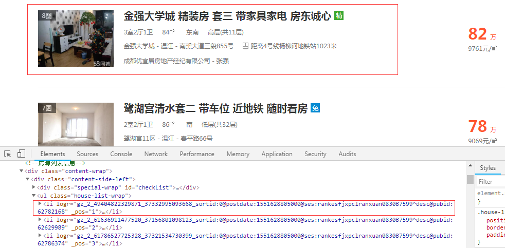
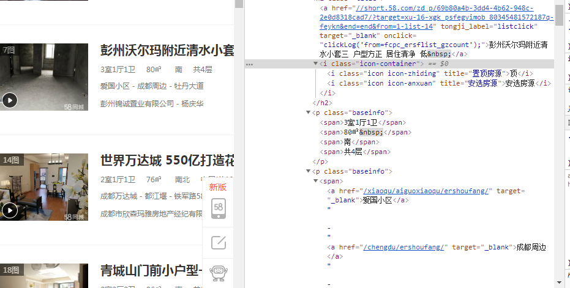

# 爬虫常用的解析库

抓取网页后需要对网页中的信息进行提取，下面介绍几种解析库

以58同城的二手房信息为例子来进行演示(需要先安装Python)

- 打开58同城二手房网页

https://cd.58.com/ershoufang/?utm_source=market&spm=u-2d2yxv86y3v43nkddh1.BDPCPZ_BT&PGTID=0d100000-0006-6940-5050-e4ad5edbfcd0&ClickID=4

- 查看网页结构

  

  ---

  

  **通过观察发现每个li标签对应一个房屋信息,只需对li标签的内容进行解析就行了**

  

  

  

  #### 运行结果

  ```
  ###	
  光华大道沿线地 铁口房东急售 急售电梯跃层套四1 
  135万
  格林大道 套三 两梯三户 客厅带阳台 随时看房 
  115万
  锦江区攀成钢4.8米客厅挑高 9米层高套四 带装 
  418万
  郫都区安德 多层顶跃 现房发售 首付29万 单价 
  58万
  ###
  ```

  

  

  

  

  

  

**1.lxml**

```
lxml是python的一个解析库，支持HTML和XML的解析，并且支持XPath解析方式,安装方式也比较简单，直接用pip安装就行了，pip install lxml
```

下面对每个房屋的标题和价格进行提取

```
import requests
from lxml import etree

url = 'https://cd.58.com/ershoufang/?utm_source=market&spm=u-2d2yxv86y3v43nkddh1.BDPCPZ_BT&PGTID=0d100000-0006-6940-5050-e4ad5edbfcd0&ClickID=4'
res = requests.get(url)
#判断状态码是否为200
if res.status_code == 200:
	#返回str类型数据
	content = res.content.decode('utf-8')

	#调用etree.HTML类进行初始化，构建一个XPath解析对象
	html = etree.HTML(content)
	#'/'表示取子节点，'//'表示取子孙节点
	#用//开头的XPath规则来选取所有符合要求的节点
	results = html.xpath("//ul[@class='house-list-wrap']//li") #获取class属性为house-list-wrap下所有的li标签
	for result in results:
		title = result.xpath('.//h2[@class="title"]/a/text()') #.//指从当前节点开始匹配,返回一个列表
		print(title[0])
		price = result.xpath('.//div[@class="price"]/p/b/text()')
		print(price[0]+"万")
else:
	print("error")

```

**2.BeautifulSoup**

BeautifulSoup在解析的时候需要用到解析器，常用lxml做解析器

```
from bs4 import BeautifulSoup

from urllib import request
from lxml import etree

url = 'https://cd.58.com/ershoufang/?utm_source=market&spm=u-2d2yxv86y3v43nkddh1.BDPCPZ_BT&PGTID=0d100000-0006-6940-5050-e4ad5edbfcd0&ClickID=4'

#使用urllib请求库
res = request.urlopen(url)

if res.status == 200:
	# res.read()获取的结果是字节型数据
	content = res.read().decode('utf-8')
	# BeautifulSoup对象初始化,第二个参数为解析器的类型
	soup = BeautifulSoup(content, 'lxml')
	# 使用CSS选择器来选择节点
	for li in (soup.select(".house-list-wrap li")):
		title = li.select(".list-info a") #返回列表类型
		price = li.select(".price p b")
		if title:
			print(title[0].string) #string输出对应节点的文本
		if price:
			print(price[0].string + "万")
```

**3.pyquery**

pyquery库相当于jQuery的Python实现，能够以jQuery的语法来操作解析 HTML 文档 

```
from pyquery import PyQuery as pq

url = 'https://cd.58.com/ershoufang/?utm_source=market&spm=u-2d2yxv86y3v43nkddh1.BDPCPZ_BT&PGTID=0d100000-0006-6940-5050-e4ad5edbfcd0&ClickID=4'

# 初始值的参数不仅可以传字符串，还能传网址，需要指定参数url
doc = pq(url=url)
houses = doc('.house-list-wrap li')
# 使用items() 方法进行遍历
for house in houses.items():
    title = house('.list-info a')
    price = house('.price p b')
    if title:
        print(title.text())  # text()输出对应节点的文本
    if price:
        print(price.text()+ '万')
```

